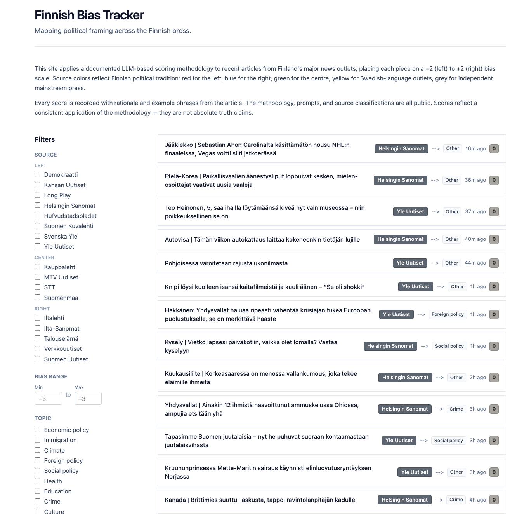

# Finnish Bias Tracker

> Open-source bias detection for Finnish news media. Scores articles across the political spectrum, scores each one with a documented methodology, and makes the framing visible.

[](https://www.gnu.org/licenses/agpl-3.0)
[]()

## Try the demo

<!-- TODO: replace with deployed URL once #M6-deploy lands -->
**Live demo**: _coming soon_ — the project is deployed alongside its infrastructure (#M6). Until then, see the screenshot below.



## What this project does

Finnish news media has a political spectrum that doesn't map cleanly onto US-style "red vs blue." Party-organ press is still openly active (Kansan Uutiset for the Left Alliance, Suomen Uutiset for the Finns Party, Verkkouutiset for Kokoomus). Yle plays a state-broadcaster role that doesn't exist in most other Western democracies. Swedish-language outlets cover the same events as their Finnish-language counterparts but often with different editorial positions.

This project applies a documented LLM-based scoring methodology to recent articles from Finland's major news outlets, placing each piece on a −2 (left) to +2 (right) bias scale. Every score is recorded with the full rationale and specific phrases from the article that drove it. The methodology, prompts, source classifications, and scoring history are all public, this means anyone can audit them.

The project is _not_ trying to declare which articles are true. It's trying to make framing visible. Two outlets covering the same event can describe it in ways that emphasize different facts, choose different sources, and use different language. The bias tracker lets readers see those framing differences directly.

## What it shows you

- **A list of recent articles** across all 11 indexed sources, with bias scores visible at a glance
- **Filters** by source, bias range, topic, language, and date — URL-shareable
- **Article detail pages** showing the full LLM rationale, examples extracted from the article, and version history if the article has been rescored under multiple prompt revisions
- **A source comparison page** showing how every Finnish outlet covered a given topic in a given period — including average bias, distribution, and sample articles per source
- **A methodology page** explaining the bias scale, prompt evolution, source classifications, and known limitations honestly

## Sources currently indexed

11 sources covering Finland's mainstream, party-organ, and Swedish-language press:

| Bias | Sources |
|------|---------|
| Left (−2) | Kansan Uutiset, Demokraatti |
| Center-Left (−1) | Yle, Helsingin Sanomat, Hufvudstadsbladet, Svenska Yle |
| Center (0) | Suomenmaa |
| Center-Right (+1) | Iltalehti, Ilta-Sanomat, Verkkouutiset |
| Right (+2) | Suomen Uutiset |

Source-level classifications are editorial judgments based on ownership, party affiliation, and editorial history. They are not uncontested. Individual articles often score differently from their source's baseline classification — the comparison page exists to make those differences visible.

See the [methodology page](#TODO-add-link-after-deploy) for the full inventory with reasoning and the per-source bias classifications.

<!-- TODO: replace the methodology page link above with the deployed URL once #M6 lands -->

## Status

**Pre-alpha.** The methodology has known limitations: single-LLM scoring without inter-annotator agreement, English-language prompt scoring Finnish/Swedish content, quota-gated free-tier LLM operation, and small sample sizes early on. These are documented openly in the methodology page rather than hidden — bias detection that hides its workings isn't a methodology, it's an oracle.

If you're a Finnish journalist, media researcher, or computational linguist and you have feedback on the methodology or source classifications, opening an issue is the best contribution you can make right now.

## License

[AGPL-3.0](LICENSE). Forks must remain open source. The license choice is intentional — methodology transparency is the project's reason for existing, and a derivative that hid its workings would defeat the purpose.

The prompts, source classifications, and scoring rationale are all publicly auditable. The project's credibility depends on that auditability.

---

## For developers

The rest of this document covers the engineering side — repo layout, dev setup, and contribution workflow.

### Workspaces

The repository is a monorepo with three workspaces:

- **`apps/api/`** — Hono API in TypeScript. Serves the data layer to the frontend and any other consumers.
- **`apps/scrapers/`** — Python scrapers and LLM scoring pipeline. Reads from news sources, writes articles and scores to Postgres.
- **`apps/web/`** — SvelteKit frontend. The user-facing interface — article list, filters, article detail, source comparison, methodology explainer.

Each workspace has its own `README.md` with setup and dev instructions.

### Tech stack

- **Backend**: TypeScript + [Hono](https://hono.dev)
- **Database**: PostgreSQL 16 + [Drizzle ORM](https://orm.drizzle.team) + pgvector
- **Cache/Queue**: Redis 7 + [BullMQ](https://docs.bullmq.io) (future M3 work)
- **Scrapers**: Python 3.12 (`feedparser`, `trafilatura`)
- **LLM scoring**: Google Gemini 2.5 Flash-Lite (with Anthropic Claude as a fallback provider)
- **Frontend**: SvelteKit 2.x + Tailwind CSS 4.x
- **Infrastructure** (planned): Docker Compose (dev) → Hetzner VPS (prod) via Terraform

### Local development

#### Prerequisites

- Node.js 20+
- Python 3.12+
- Docker + Docker Compose
- A [Google AI Studio API key](https://aistudio.google.com/) for Gemini (free tier works)
- Optionally: an [Anthropic API key](https://console.anthropic.com) as a fallback scorer

#### Setup

```bash
# Clone
git clone https://github.com/CapoMK25/Finnish-Bias-Tracker.git
cd Finnish-Bias-Tracker

# Environment configuration
cp .env.example .env
# Edit .env with your API keys

# Start Postgres + Redis via Docker
docker compose -f docker-compose.dev.yml up -d

# Install dependencies for all workspaces (from repo root)
npm install

# Set up the Python scraper environment
cd apps/scrapers
python3.12 -m venv .venv
source .venv/bin/activate
pip install -r requirements.txt
cd ../..

# Run database migrations
npm run db:migrate

# Seed the source list
npm run db:seed
```

#### Running

In separate terminals:

```bash
# Backend API (port 3000)
npm run dev:api

# Frontend (port 5173)
npm run dev:web

# Scrape a small batch of articles
cd apps/scrapers
source .venv/bin/activate
./scripts/scrape_all.sh 5
```

Visit `http://localhost:5173` for the frontend, `http://localhost:3000` for the API.

### Project structure

Finnish-Bias-Tracker/
├── apps/
│   ├── api/            # Hono backend (TypeScript)
│   ├── web/            # SvelteKit frontend
│   └── scrapers/       # Python scrapers + LLM scoring
├── packages/
│   └── shared/         # Shared TypeScript types
├── docs/
│   ├── methodology.md  # Bias methodology and scoring approach
│   ├── sources.md      # Annotated source list
│   ├── roadmap.md      # Development milestones
│   ├── architecture.md # System architecture decisions
│   └── screenshots/    # Documentation imagery
├── infra/
│   └── terraform/      # Production infrastructure as code (M6)
├── docker-compose.dev.yml
└── .github/workflows/  # CI/CD

### Contributing

Pre-alpha. Not accepting code contributions yet, but feedback on methodology is highly welcome — open an issue.

Especially valuable contributions:

- Finnish journalists or media researchers willing to review source classifications
- Native Finnish speakers willing to audit LLM bias scoring outputs
- Anyone with relevant academic background in media studies

### Disclaimer

This tool provides analytical perspectives on news coverage. Bias scores are **not absolute truth claims** — they reflect a documented methodology applied consistently. Users are encouraged to read the methodology, inspect the data, and form their own conclusions. AI-generated bias scores are clearly labeled as such, per EU AI Act transparency requirements.